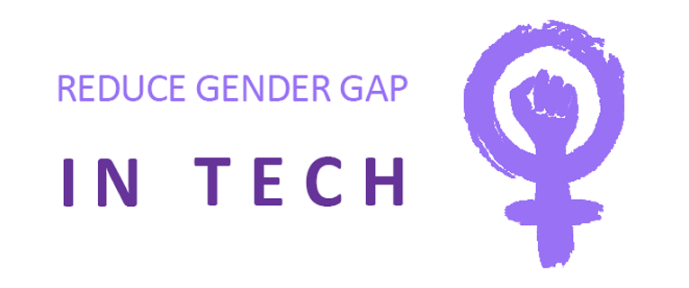

### About

This project is a web page about Ada Lovelace. It was developed during Eu Progr{amo} course, accomplished by **[@programaria](https://github.com/programaria)**.

PrograMaria's mission is to empower women in tech and reduce the gender gap in the area.

Learn more at [PrograMaria](https://www.programaria.org/).

### Other initiatives

- [Reprograma](https://reprograma.com.br/)
- [Laboratoria](https://www.laboratoria.la/br)
- [Women who code](https://www.womenwhocode.com/)
- [Girls in tech](https://girlsintech.org/)

